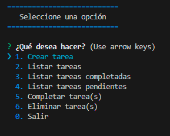
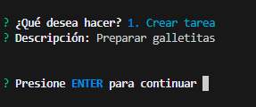
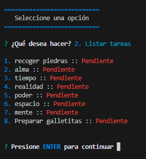
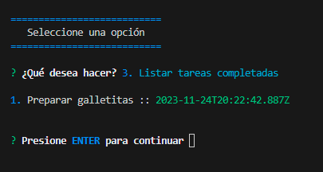
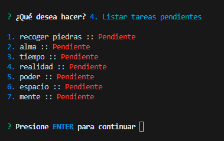
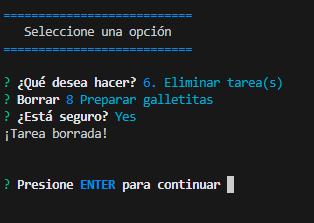

#Notas:

###**Pantalla principal** 

###**Creación de tareas**

###**Listar todas las tareas**

###**Listar las tareas completadas**

###**Listar las tareas pendientes**

###**Marcar tarea(s) como completada(s) o pendiente(s)**

###**Eliminar una tarea**

