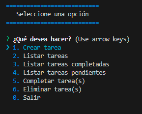

TODO APP CONSOLA
======
    Con esta app de consola se pueden realizar las sigientes acciones:
                                        
1. **Creación de tareas**
2. **Listar todas las tareas**
3. **Listar las tareas completadas**
4. **Listar las tareas pendientes**
5. **Marcar tarea(s) como completada(s) o pendiente(s)**
6. **Eliminar una tarea**

*_ Se utilizó NodeJs, JavaScript y paquetes como Colors, Inquirer y uuid. _*

***

